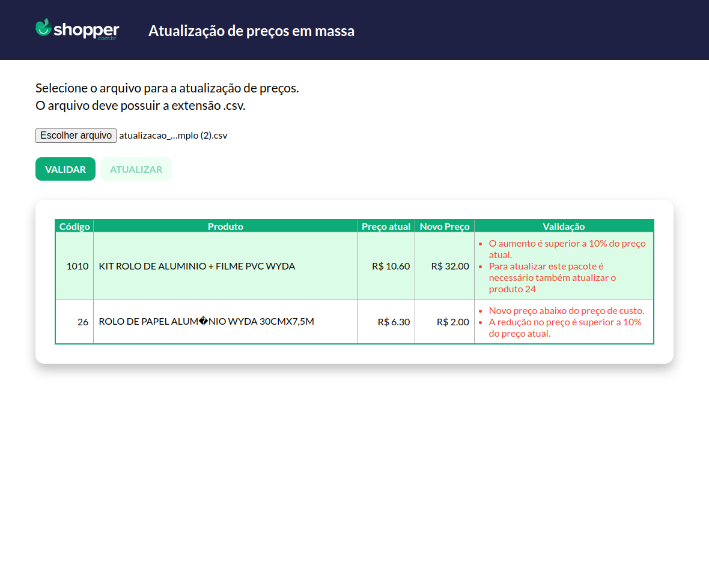

  # Teste técnico para Desenvolvedor Full Stack Jr. para Shopper.com.br

  ## Front end

O front end da aplicação foi desenvolvido em React com Typescript, utilizando o Vite para configuração inicial do projeto.

Para estilização foi utilizado styled-components e para comunicação do a API do back end foi utilizado o Axios.

## Layout
O layout criado foi pensado para ser uma tela simples porém seguindo algumas caracteristicas do site da Shopper.com.br.

